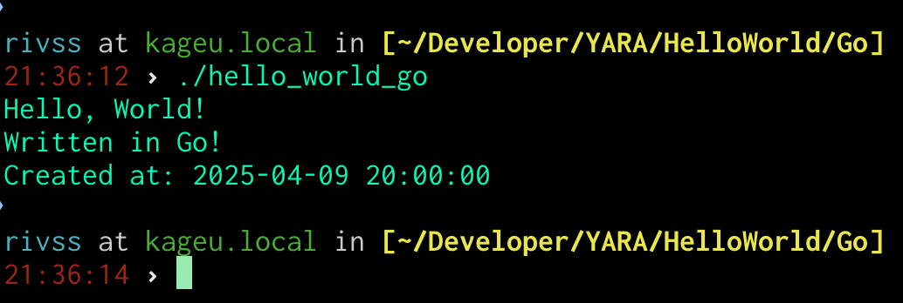
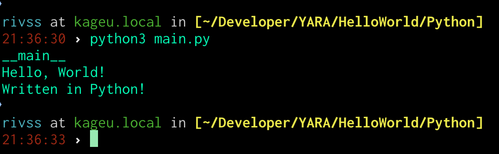
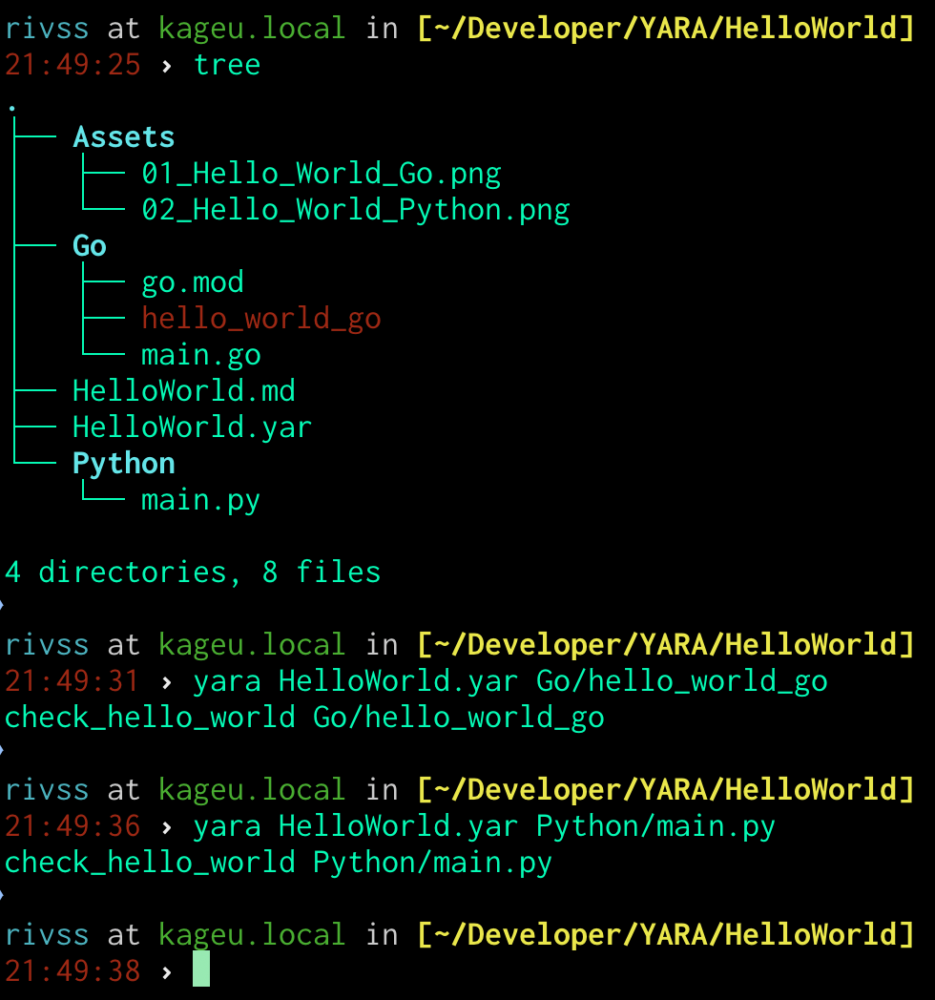

# Hello, World!

[RTFM --- Dokumentacja YARA](https://yara.readthedocs.io/en/latest/writingrules.html#writing-yara-rules)

---
Myślę, że każdą przygodę z poznawaniem nowego języka rozpoczynamy od Hello, World! Tutaj nie postąpimy inaczej.

W celu zapoznania się z narzędziem YARA utworzyłem dwa proste projekty napisane w językach **Go** oraz **Python**, które mają na celu wykonanie tej samej rzeczy.

Plik *Go/main.go*:

```go
package main

import "fmt"

func main() {
	fmt.Println("Hello, World!")
	fmt.Println("Written in Go!")
	fmt.Println("Created at: 2025-04-09 20:00:00")
}
```

Nadszedł czas na utworzenie pliku wykonywalnego. W tym celu wykonałem następujące czynności:

```txt
1. $ go mod init github.com/0xKAGE/hello-world-go
2. $ go mod tidy
3. $ go build -o hello_world_go
```

Wykonując ostatni krok został utworzony plik wykonywalny dla mojej maszyny o przekazanej nazwie: `hello_world_go`. 



Za pomocą polecenia `file hello_world_go` wykonałem prostą analizę pliku dzięki czemu uzyskałem podstawowe informacje takie jak, format, architektura, czy jest to plik wykonywalny, tekstowy, skompilowany, itp.

```sh
$ file hello_world_go

hello_world_go: Mach-O 64-bit executable arm64
```

Plik *Python/main.py*:

```python
def main() -> None:
    print(__name__)
    print("Hello, World!")
    print("Written in Python!")


if __name__ == '__main__':
    main()
```




Analiza pliku za pomocą polecenia `file main.py`

```sh
$ file main.py

main.py: Python script text executable, ASCII text
```

---

Nadszedł czas na utworzenie pierwszej reguły w **YARA**.

Plik *HelloWorld.yar*:

```yara
rule check_hello_world
{
    meta:
        author = "Rivss (0xKAGE)"
        description = "Simple YARA rule to check if 'Hello,World!' string exists in given file."
        date = "2025-04-09"
        time = "20:00"

    strings:
        $hello_world_str = "Hello, World!"

    condition:
        $hello_world_str
}
```

--- 

Wyjaśnienie reguły:

```yara
rule check_hello_world // Tutaj utworzyliśmy nazwę dla naszej reguły
```

---

Sekcja **meta** w regule YARA służy do przechowywania **dodatkowych informacji** o samej regule, takich jak autor, opis, data utworzenia, wersja, itp. Te informacje są tylko informacyjne i nie wpływają na działanie reguły, ale są pomocne przy dokumentowaniu i zarządzaniu regułami.

```yara
meta:
	author = "Rivss (0xKAGE)"
    description = "Simple YARA rule to check if 'Hello,World!' string exists in given file."
    date = "2025-04-09"
    time = "20:00"
        
```

---

Sekcja **strings** w regule YARA zawiera **ciągi znaków** lub **wzorce bajtowe**, które są używane do wykrywania pasujących fragmentów w analizowanych plikach. Celem tej sekcji jest zdefiniowanie, jakie dane będą poszukiwane w pliku, aby reguła mogła dopasować się do pliku na podstawie tych danych. Ciągi w tej sekcji mogą być różnego rodzaju, np. tekstowe ciągi znaków lub bajty w formacie szesnastkowym.

```yara
strings:
    $hello_world_str = "Hello, World!" // Tekst, który będziemy szukać w naszych plikach
```

---
Sekcja **condition** w regule YARA jest jedną z najważniejszych części, ponieważ **określa, kiedy reguła pasuje** do analizowanego pliku. W sekcji tej definiujemy logiczne warunki, które muszą być spełnione, aby reguła została uznana za **dopasowaną**. Mój warunek sprawdza czy w analizowanym pliku znajduje się ciąg znaków lub wzorzec przypisany do zmiennej `$hello_world_str`.

```yara
condition:
    $hello_world_str // Zmienna utworzona w sekcji strings
```

--- 

Teraz kiedy wiemy co nasza reguła ma zrobić oraz mamy przygotowane pliki, które możemy przeanalizować nadszedł czas na uruchomienie naszej reguły. 

```sh
$ yara HelloWorld.yar Go/hello_world_go

check_hello_world Go/hello_world_go
```

```sh
$ yara HelloWorld.yar Python/main.py

check_hello_world Python/main.py
```


